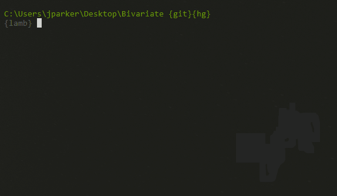

##### *An opinionated interface for writing, running, and saving BackstopJS tests*


## Goal
**Bivariate**'s goal is to allow for an approachable Visual Regression Testing suite that can be organized to accommodate small and large projects without overwhelming complexity.


  

This goal is achieved by enforcing an opinionated grouping structure, providing a method to easily write tests via manageable object files, as well as allowing for all of BackstopJS's commands to be run from an interface.


## Installation
**Bivariate** runs in [Node](https://nodejs.org) and also requires [Python](https://www.python.org/) for it's DOM manipulation capabilities (leveraging CasperJS).

* Download the Latest version of Bivariate

* Install [NodeJS](https://nodejs.org)

* Install [Python](https://www.python.org/)

* Run the following from the command line (in the Bivariate directory):  
`npm install`


## Folder Structure

*All tests, scripts, and configuration files are stored in the `bivariate_data` parent folder.*

`bivariate_data`  
|  
+---- `test_scripts` holds user defined configuration and tests for to instruct BackstopJS  
|  
+---- `casper_scripts` holds user defined CasperJS scripts for interacting with the DOM before saving a screen shot  
|  
+---- `bitmaps_reference_archive` holds archived *references* that can be restored and tested against  


### test_scripts

Out of the box, BackstopJS gets all of its config and test data from a single JSON file, which isn't very maintainable over time.  Luckily, **Bivariate** takes advantage of Node's module system to break this all apart and just return what is needed (*a simple array of objects*).

##### Configuration files

All configuration files are prefixed with a double underscore: \_\_  

###### \_\_config-baseURLs.js
holds the *base* URLs for all References and Tests to be run.  
```
...
  // do not use a trailing slash in the base URLs
  theURLS.baseURL = "http://your-base-url";
  theURLS.baseRefURL = "http://your-base-reference-url";
...
```

###### \_\_config-common.js  
set of *common* config values (rendering engine, ports, etc.) that shouldn't need to be adjusted in most cases.

###### \_\_config-viewports.js  
 configure any number of *viewports* to test against (this can include any number of defined screen resolutions).


##### Individual Tests  
All individual tests are prefixed with a single underscore: \_  

Use the example tests as a template to create your own.  Tests are easy to setup and for the most part only require you to fill out the value for a few variables:
* label
* route
* selectors

`_example-test--home.js` :

````js
// -------------------
// - test definition -
// -------------------

// * tests should be saved as: '_test-name.js'
//   if you have a lot of tests you can store
//   related tests in named subdirectories
//   for better organization

var label = 'Example Test - Home Page'; // test name
var route = '/index.html';              // the route for this test (must start with a '/')
var selectors = [                       // selectors for elements to be "captured" (CSS selector syntax)
    "body",
    "h1",
    ".hero",
    ".nav",
    ".body-content"
];
var onBeforeScript = null;          // Runs before each scenario
                                    // -- use for setting cookies or other env state
                                    // (.js suffix is optional / looks for file in 'casper_script' dir)
var onReadyScript = null;           // Runs after onReady event on all scenarios
                                    // -- use for simulating interactions
                                    // (.js suffix is optional / looks for file in 'casper_script' dir)
var hideSelectors = [];             // hide elements from view by changing its "visibility" to "hidden"
var removeSelectors = [];           // remove elements from the DOM before screen capture


// ---------------------------------------------
// - advanced options can be overwritten below -
// ---------------------------------------------
module.exports = function(baseURLs) {
    return {
        "label": label,
        "url": baseURLs.baseURL + route,
        "referenceUrl": baseURLs.baseRefURL + route,
        "hideSelectors": hideSelectors,
        "removeSelectors": removeSelectors,
        "selectors": selectors,
        "readyEvent": null,
        "delay": 100,
        "misMatchThreshold" : 0.1,
        "onBeforeScript": onBeforeScript,
        "onReadyScript": onReadyScript
    };
};

````

##### Test Groups  
Bivariate presents and runs tests using a grouping concept.  A `test group` is a collection of `tests` that are run together.  A test group is a .js file that does not start with any underscores.  

Use the provide file `example-test-group.js` as a template for your own.  Note that all that is required is to fill in the `Senarios` section to include which tests you want run.

`example-test-group.js` :

````js
// ----------------
// -- Test Group --
// ----------------

var mixIn = require("mout/object/mixIn");
var testGroup = __filename.slice(__dirname.length + 1, -3);
var configCommon = require('./__config-common')(testGroup);
var baseURLs = require("./__config-baseURLs");


module.exports = mixIn(
    {
        // ---------------
        // -- Scenarios --
        // ---------------
        "scenarios": [
            require('./_example-site--home')(baseURLs),
            require('./_example-site--trees')(baseURLs)
        ],
    },
        configCommon
);
````


### casper_scripts

CasperJS scripts are used to interact with your web pages using the `before` and `on ready` events.  Each test you create has an optional parameter of `onBeforeScript` & `onReadyScript`.  These can simply point to script files in the 'casper_scripts' directory.  The two example scripts found in the `casper_scripts` directory should be self explanitory (`onBefore-Example.js` & `onReady-Example.js`).  In addition you can refer to the [CasterJS Docs](http://docs.casperjs.org/en/latest/) for more advanced examples.


### bitmaps_reference_archive
The `bitmaps_reference_archive` folder holds archived `references` which can be created, archived, and restored using the **Bivariate** app.


----

## App


# *further documentation to come...*
