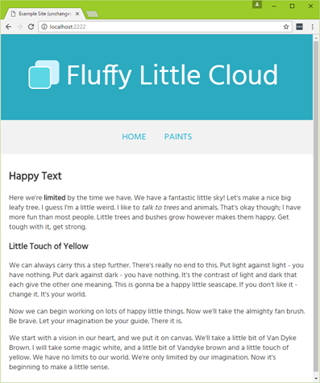
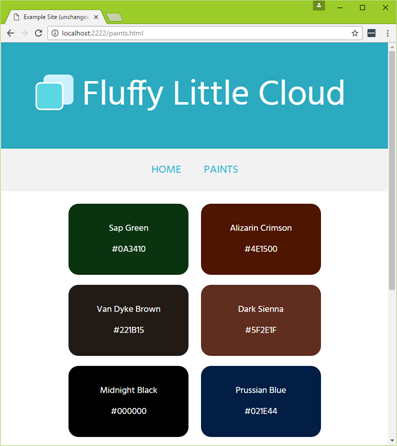
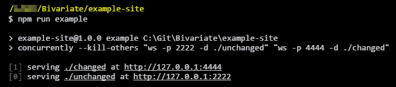
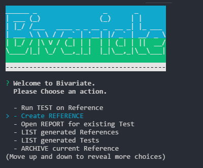
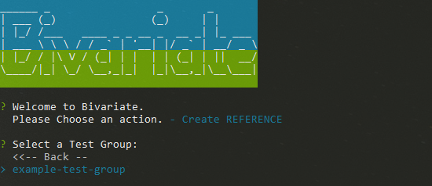
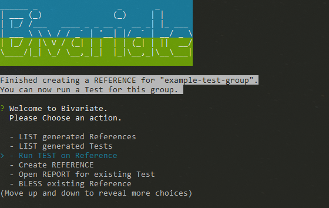
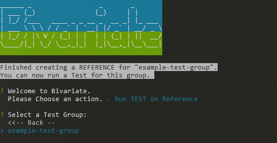
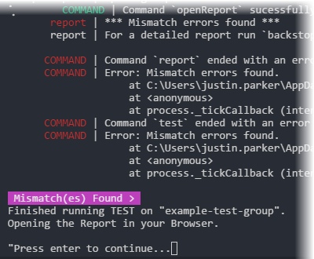
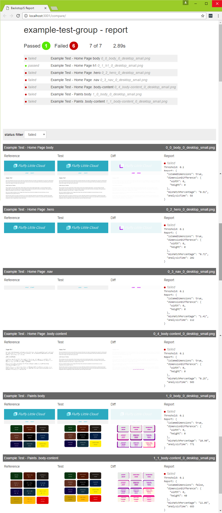

# Example Site

This directory contains a sample site in its original state (`unchanged`), as well as with some css changes applied (`changed`).

The example site is a simple, straight-forward two page site.  

  

  

### The differences applied to the `changed` version is the **size** of the logo and some misc. **padding** on a few elements.  
.

You can host the two sites yourself to run the example test that comes with **Bivarate** (`unchanged/index.html`, `changed/index.html`), or run them separately using the following steps (*preferred method*):

* from this directory in your console run: `npm install`  
(this will install the `local-web-server` package for hosting the example sites)  

* run the following to laungh the `unchanged` and `changed` example sites:  
`npm run example`  

      

### Run Example

Now that the Example site is running (both `unchanged` and `changed`), you can run the example test suite (assuming you didn't remove the files from the `bivariate_data` directory).

In the console run **Bivariate** and select the following entries from the interface:

###### Create a Reference
  

###### Select a Test Group to Create a Reference on

###### Run a Test

###### Select a Test Group to Run a Test on

###### Wait for the Test to Complete

###### A Web Browser should open and display the Report
by default the report show all `failed` tests with the reference on the left, test in the middle, and pixel differences on the right.  

