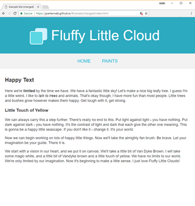
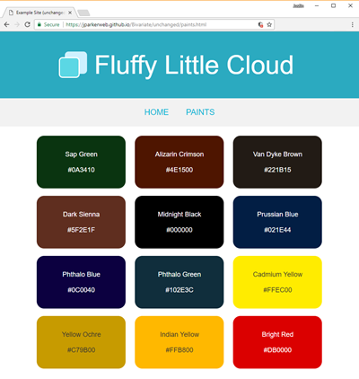
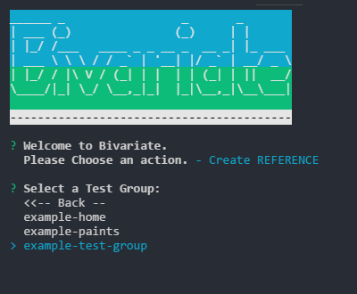
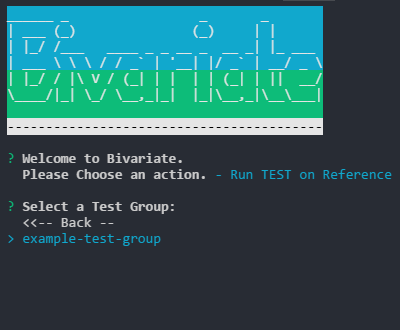
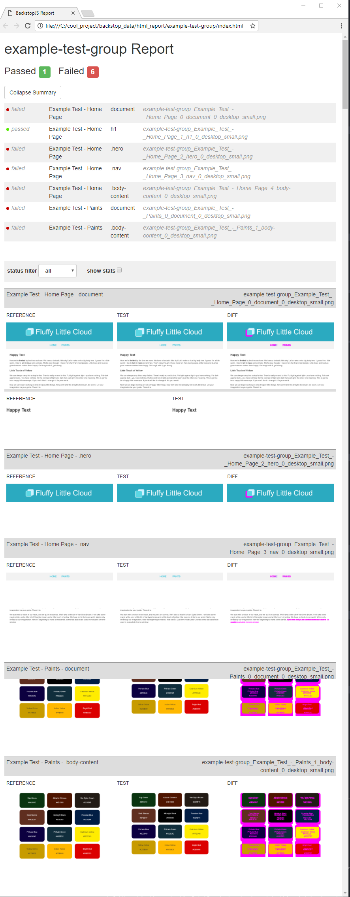

# Example Site

This directory contains a sample site in its original state (`unchanged`), as well as with some css changes applied (`changed`).

The example site is a simple, straight-forward two page site.  

  

  

### The differences applied to the `changed` version is the **size** of the logo and some misc. **padding** on a few elements.  
.

These two sites are hosted on Github pages and the example tests that Bivariate generates is already configured to work with them.  The urls are as follows:

* https://jparkerweb.github.io/Bivariate/unchanged/
* https://jparkerweb.github.io/Bivariate/changed/

### Run Example

To run the example that ships with Bivariate, in the console type `bivariate` from your project folder and select the following entries from the interface:

###### Create a Reference
  

###### Select a Test Group to Create a Reference on

###### Run a Test

###### Select a Test Group to Run a Test on

###### Wait for the Test to Complete

###### A Web Browser should open and display the Report
by default the report show all `failed` tests with the reference on the left, test in the middle, and pixel differences on the right.  

----
## Example Animated GIF showing the full example

